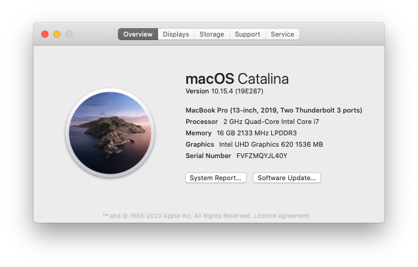

# macOS on Thinkpad X1 Carbon 7th Generation, Model 20QE*, 20QD*
OpenCore-based Hackintosh EFI and guide for Lenovo Thinkpad X1 Carbon Gen 7. This guide has been generated for both the above model numbers.

  

## What is Working

<strong> WHAT IS WORKING </strong>

In short, x1c7-hackintosh is very stable and is currently my daily driver. I fully recommend this project to anyone looking for a MacBook alternative. 

### Install
| working | Device / Step                             | Comment            |
|:-------:|:------------------------------------------|:-------------------|
| ☑️ | **Basic Setup**                                 |                    |
| ✅ | Booting macOS installer                        |                    |
| ✅ | Installed to HD                                |                    |

### Post-Install

| working | Device / Step                             | Comment            |
|:-------:|:------------------------------------------|:-------------------|
| ✅ | Graphics                                       | Requires `WhateverGreen.kext` |
| ✅ | Touchpad                                       | Requires ``VoodooGPIO, VoodooI2CServices,VoodooInput`` This was very trial-and-error based and I reccomend looking at our config.plist. Order and location matter. |
| ✅ | Trackpoint                                     | Requires ``VoodooPS2`` |
| ✅ | Keyboard                                       | Requires ``VoodooPS2`` |
| ✅ | Keyboard-Multimedia Fn keys                    | Requires `YogaSMC.kext` + **TODO: Add ACPI here** and [YogaSMC-App](https://github.com/zhen-zen/YogaSMC) |
| ✅ | WiFi                                           | Native WiFi with `AirportItlwm.kext` - no companion app required |
| ✅ | Bluetooth                                      | `IntelBluetoothFirmware` might depend on `AirportItlwm`, that requires Apple's secure boot  |
| ❌ | WWAN                                           | DISABLED at BIOS to conserve power|
| ✅ | Ethernet                                       | `IntelMausi.kext` for bundled USB-C adapter |
| ✅ | Hibernation                                    | hibernatemode=3|
| ✅ | HDMI output                                    | Requires **WEG?** |
| ✅ | USB A / USB C                                  |           |
| ✅ | Thunderbolt 3                                  |           |
| ✅| Webcam                                         | _checked on 2021-02-19_ |
| ✅ | Audio                                          | ✅ _Internal Speaker_ and _Headphones_ / _Line in_   ⚠️ _Internal Microphone_ not working   Realtek ALC285, layout 11, 21, 31 (all seem to work equal) **TODO supported layouts have changed** ➡️ ``boot-args: alcid=21`` |
| ✅ | iCloud (App Store, iMessage, FaceTime, etc)    | All iServices work |
| ❓ | HiDPI, Handoff, Sidecar                        | Handoff/sidecar sporadic function. Would not rely on these|
| ❌ | Fingerprint Reader                             | Disabled in BIOS to save power|
| ✅ | Power Management Optimizations                 | Fully working with CPUFriend and CPUFriendFriend, more options with YogaSMC to come |
| ✅ | Intel SpeedStep                                | Fully working (Higher performance when plugged in, lower when on battery, tested with GeekBench 5) |

> ✅ Fully functional; ❓ Untested/Intermittent (might work); ❌ Non-functional

## Hardware

<strong> HARDWARE </strong>

**Again: These are the hardware specs of `20QES01L00` and `20QD-000SUS`:**
Refer to [ThinkPad_X1_Carbon_7th_Gen_Spec.PDF](https://github.com/suhrmann/x1c7-hackintosh/blob/master/docs/references/ThinkPad_X1_Carbon_7th_Gen_Spec.PDF) for possible stock ThinkPad X1 7th Gen configurations.  
Source: [Lenovo Product Specification Reference (PSREF) [psref.lenovo.com]](https://psref.lenovo.com/Product/ThinkPad/ThinkPad_X1_Carbon_7th_Gen)

| Processor Number                                                                                                                   | Code Name    | # of Cores | # of Threads | Base Frequency | Max Turbo Frequency | Cache | Memory Types | Graphics      |
| :--------------------------------------------------------------------------------------------------------------------------------- | :----------- | :--------- | :----------- | :------------- | :------------------ | :---- | :----------- | :------------ |
| [i7-8565U](https://ark.intel.com/content/www/us/en/ark/products/149091/intel-core-i7-8565u-processor-8m-cache-up-to-4-60-ghz.html) | Whiskey Lake  (based on Coffee Lake) | 4          | 8            | 1.8 GHz        | 4.6 GHz             | 8 MB  | LPDDR3-2133  | Intel UHD 620 |
| [i7-8665U](https://ark.intel.com/content/www/us/en/ark/products/193563/intel-core-i7-8665u-processor-8m-cache-up-to-4-80-ghz.html) | Whiskey Lake  (based on Coffee Lake) | 4          | 8            | 1.9 GHz        | 4.8 GHz             | 8 MB  | LPDDR3-2133  | Intel UHD 620 |

|                  |                 |
| :--------------- | :-------------- |
| **Ports**        | 2x USB 3.1 Gen 1 (Right USB Always On) |
|                  | 2x USB 3.1 Type-C Gen 2 / Thunderbolt 3 (Power Delivery and DisplayPort) [Max 5120x2880 @60Hz] |
|                  | HDMI 1.4b (Max 4096x2160 @24Hz) |                 |
| **Ethernet**     | via ThinkPad Ethernet Extension Adapter Gen 2: I219-LM Ethernet (vPro) |
| **WLAN + BT**    | Intel Wireless-AC 9560, Wi-Fi 2x2 802.11ac + Bluetooth 5.0 |
| **WWAN(optional)** | - |
| **Display**      | 14.0" (355mm) HDR HD (1920 x 1080) |
| **Camera**       | IR and HD720p camera with ThinkShutte |
| **Audio**        | Realtek ALC3286 codec   Linux: ``Realtek ALC285``, layout 11, 21, 31 ; [@acidanthera/AppleALC > Supported codecs [Github]](https://github.com/acidanthera/AppleALC/wiki/Supported-codecs) |
| **Fingerprint reader** | ✔️ |
| **NFC (optional)** | ✔️ |

**Further Specs:**
 - Keyboard: PS/2
 - TrackPoint: PS/2, included alongside te PS2 Keyboard
 - TrackPad: Synaptics enabled i2c
 - **Thunderbolt:**  Intel JHL6540 (Alpine Ridge 4C) Thunderbolt 3 Bridge (?)

 **NOTE:** The WWAN M.2 slot does **NOT** support SSDs. "If you do manage to fit something in there, you'll be presented with this whitelist error when you try and power the laptop on" [source and photos by @acoutts [Github]](https://github.com/acoutts/x1c7-hackintosh#edit-jan-2-2020) You can modify the bios if you really need the extra SSD.

## Other Repositories

<strong> OTHER REPOSITORIES </strong>

 

- x1c7-hackintosh repositories:
    - [suhrmann/x1c7-hackintosh](https://github.com/suhrmann/x1c7-hackintosh) [fork of tylernguyen/x1c6-hackintosh]
- x1c6-hackintosh repositories:
    - [tylernguyen/x1c6-hackintosh](https://github.com/tylernguyen/x1c6-hackintosh) 
    - [benbender/x1c6-hackintosh](https://github.com/benbender/x1c6-hackintosh)
    - [zhtengw/EFI-for-X1C6-hackintosh](https://github.com/zhtengw/EFI-for-X1C6-hackintosh)
- t480-hackintosh repositories:
    - [EETagent/T480-OpenCore-Hackintosh](https://github.com/EETagent/T480-OpenCore-Hackintosh)
      Create a pull request if you like to be added, final decision at my discreation.

 

# Credits

<strong> CREDITS </strong>

    
**[Acidanthera](https://github.com/acidanthera)**   
For bringing us [OpenCore](https://github.com/acidanthera/OpenCorePkg) and maintaining all the essential kexts, 
like [VirtualSMC](https://github.com/acidanthera/VirtualSMC), [Lilu](https://github.com/acidanthera/Lilu), [WhateverGreen](https://github.com/acidanthera/WhateverGreen), and many many more! 

**Tyler Nguyen [@tylernguyen](https://github.com/tylernguyen)**  
 - for his groundwork on [macOS on Thinkpad X1 Carbon 6th Generation, Model 20KH*](
https://github.com/tylernguyen/x1c6-hackintosh)
 - and [lots of documentation](https://github.com/tylernguyen/x1c6-hackintosh/tree/master/docs) about Lenovo and ThinkPads

**[Dortania](https://dortania.github.io/)**   
for his awesome OpenCore guides - here to mention [Dortania's OpenCore Install Guide](https://dortania.github.io/OpenCore-Install-Guide/) 
and [OpenCore Post-Install](https://dortania.github.io/OpenCore-Post-Install/)

